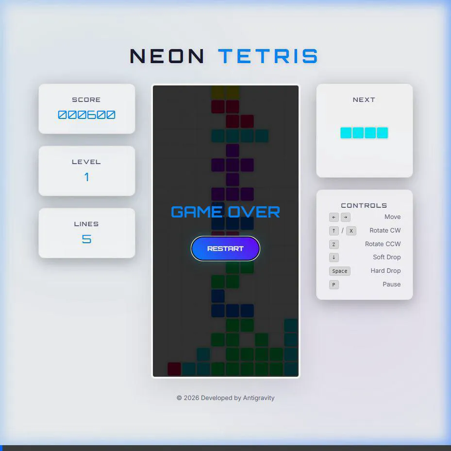

# Neon Tetris 開發總結 (淺色主題版)

本項目已成功開發完成，具備高品質的視覺效果與流暢的遊戲體驗。

## 🎮 遊戲最終演示
以下是完整測試過程的錄影，展示了遊戲啟動、方塊控制、順時針/逆時針旋轉以及 Hard Drop 功能：

## 🛠️ 已完成的修正與優化
- **UI 修正**：確保開始按鈕 (Start Button) 在遊戲啟動前正確顯示在螢幕中央。
- **主題風格**：採用現代化的「淺色霓虹」風格，具備玻璃擬態 (Glassmorphism) 的邊界感。
- **音效系統**：整合 Web Audio API，無需外部音檔即可提供即時的回饋音效。
- **路徑優化**：所有檔案連結已更新為相對路徑格式，方便離線瀏覽與 GitHub 讀取。

## 📄 專案檔案
- [index.html](./index.html): UI 佈局。
- [style.css](./style.css): 霓虹風格樣式。
- [audio.js](./audio.js): Web Audio 音效邏輯。
- [tetris.js](./tetris.js): 遊戲核心邏輯。

## 🚀 啟動方式
1. 開啟 [index.html](./index.html)。
2. 點擊畫面中央的 **"START GAME"** 按鈕。
3. 使用鍵盤方向鍵、空白鍵、Z/X 鍵進行控制。
